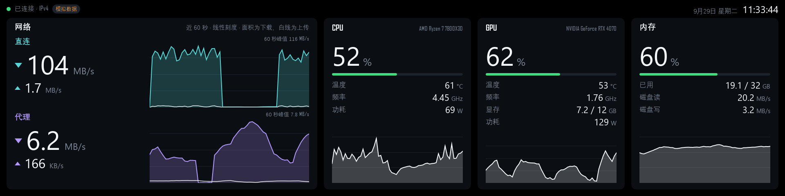

# RouterSpeed 副屏

给 8.8 寸 1920 × 480 条形副屏（计划使用 TURZX 8.8 寸普通版）做的系统仪表盘，PySide6 + QML。
目前只有界面，所有数据来自模拟数据源；以后会迁出成单独的仓库。



## 布局

整块屏 1920 × 480 像素，顶部一行状态栏，下面四张卡片：

- **状态栏**：连接状态、是否为模拟数据，右侧日期和时钟。
- **网络**（760 px 宽）：直连（青色）和代理（紫色）各一行，大号数字是下载、下面小一号是上传，
  右侧是近 60 秒曲线。曲线是**线性刻度**、按可见峰值自动缩放，面积是下载、白线是上传，
  所以曲线高度之间的比例就是真实速率的比例。
- **CPU / GPU**（各 360 px）：占用率、负载条（70% 起变橙、90% 起变红），温度（70 °C 起变橙、
  85 °C 起变红）、频率、功耗；GPU 另有显存。底部是占用率的 60 秒曲线。
- **内存**（360 px）：占用率、已用 / 总量，以及磁盘读写速率。

速率单位与 Windows 面板一致：1024 进位，100 以下保留一位小数。

## 运行

需要 Python 3.10 以上。

```powershell
py -3 -m venv $env:LOCALAPPDATA\Temp\rsv
& $env:LOCALAPPDATA\Temp\rsv\Scripts\python.exe -m pip install -r requirements.txt
& $env:LOCALAPPDATA\Temp\rsv\Scripts\python.exe main.py
```

虚拟环境放在短路径下：PySide6 里有很深的文件路径，放在层级很深的目录里会超过 Windows 260 字符的路径限制，安装会失败。

| 参数 | 作用 |
|---|---|
| （无） | 模拟器窗口，固定 1920 × 480 像素，不受 Windows 缩放影响 |
| `--screen N` | 在第 N 块屏幕上全屏显示，副屏被 Windows 识别为显示器时使用；编号不存在时会列出所有屏幕 |
| `--screenshot a.png` | 等待 `--after` 秒（默认 2.5）后截图并退出 |
| `--seed N` | 固定模拟数据的随机种子，截图可复现 |

在没有可用显示的环境（例如锁屏时）截图，改用离屏渲染：

```powershell
$env:QT_QPA_PLATFORM = 'offscreen'; $env:QT_QUICK_BACKEND = 'software'; $env:QT_QPA_FONTDIR = 'C:\Windows\Fonts'
python main.py --seed 7 --screenshot preview.png
```

离屏渲染使用 FreeType 字体引擎，个别英文字体和正常窗口里略有差异。

## 结构

| 文件 | 作用 |
|---|---|
| `main.py` | 入口与命令行参数 |
| `backend.py` | 每秒取一份快照，格式化数值、维护 60 秒历史，以属性形式交给 QML；快照格式写在文件开头 |
| `sources/mock.py` | 模拟数据：直连大文件下载的突发、代理看视频的起落、随负载变化的温度、频率和功耗 |
| `qml/` | 界面：`Main.qml` 总布局，`NetworkRow` / `StatCard` 卡片，`HistoryChart` 曲线，`Theme` 配色 |

数据源只需要提供 `sample() -> dict`（返回一份快照）和 `simulated` 属性。某项读数取不到时填 `None`，界面显示 `—`；数据源抛出异常时，状态栏显示“数据源不可用”，界面不会崩溃。

## 之后要做

- 真实数据源：网速读路由器现有的只读接口 `/cgi-bin/router-speed`，与 Windows 面板相同；
  CPU 占用、频率、内存、磁盘可用 `psutil`；温度和 GPU 需要 LibreHardwareMonitor 或 NVML，
  在 Windows 上读 CPU 温度通常需要管理员权限。
- 确认副屏的连接方式：如果被 Windows 识别为普通显示器，直接用 `--screen N`；如果是走 USB
  私有协议的“智能屏”，需要另外写推送画面的驱动。
